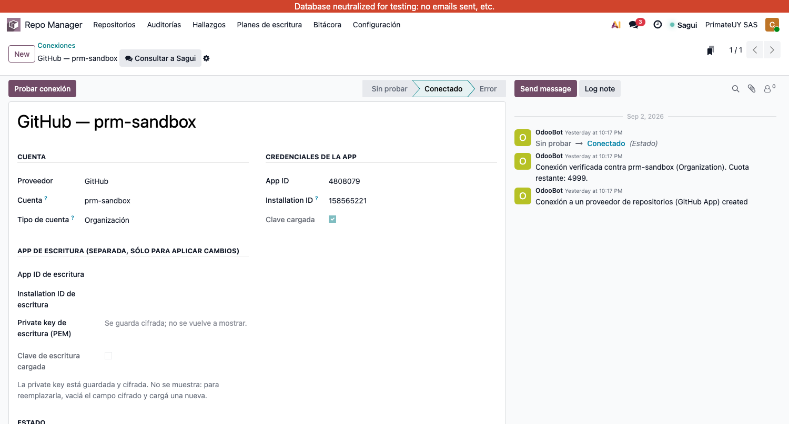
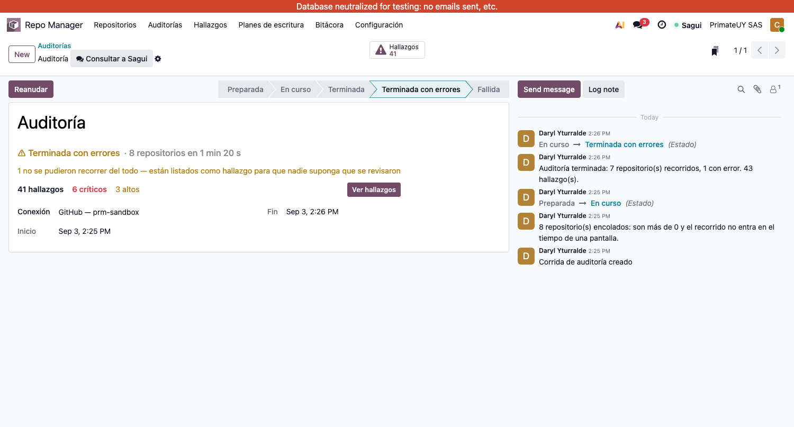
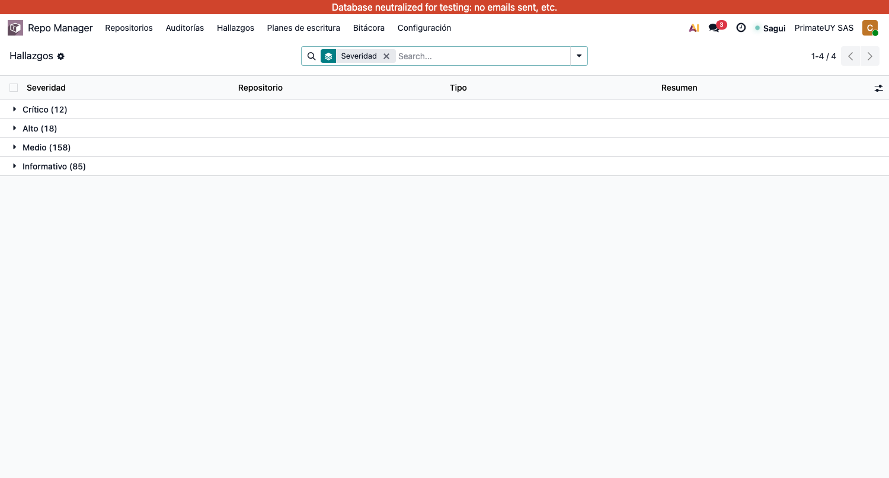
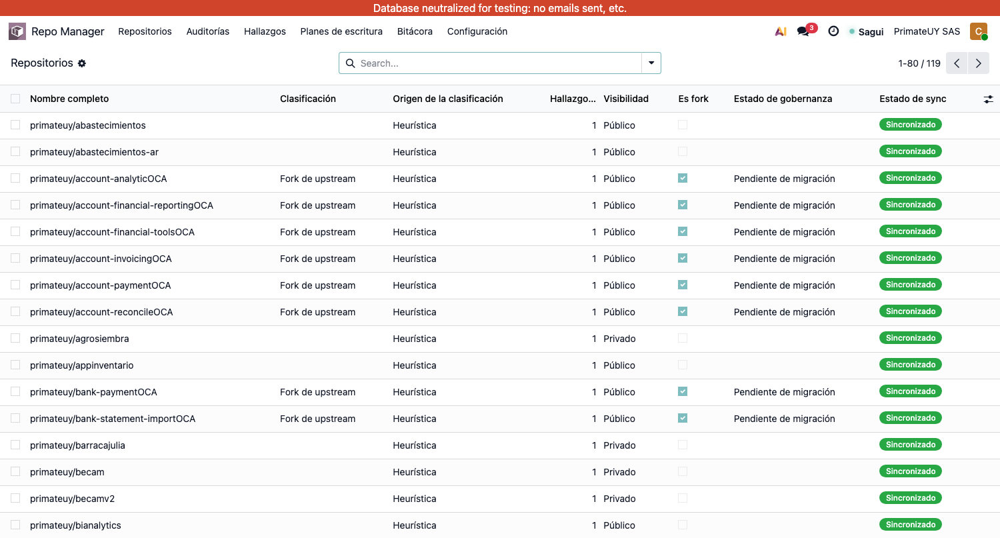
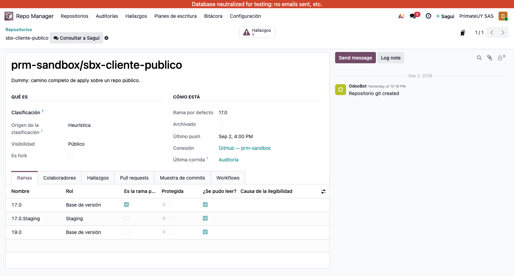
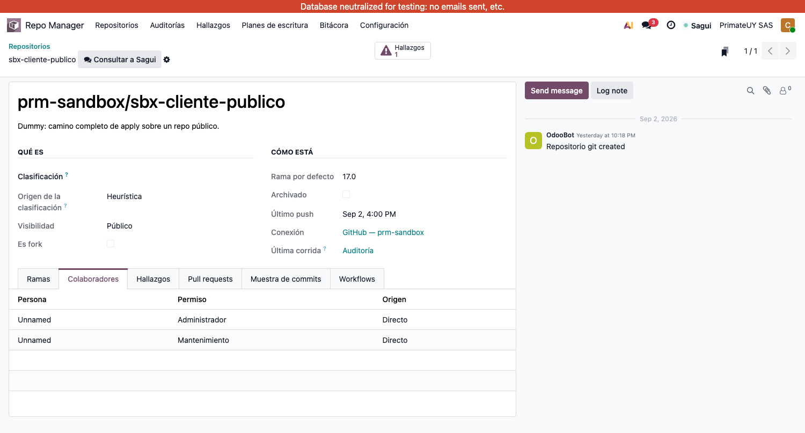
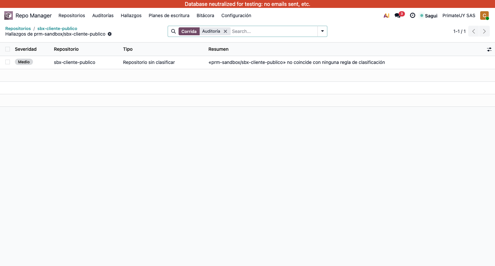

# Guía de usuario — Repo Manager

> Esta guía crece con el producto. Cada sección se escribe **después** de operar esa
> funcionalidad desde la interfaz contra la organización de pruebas, no antes.
>
> Si algo sólo se puede hacer desde la consola, no está acá: está en
> [`PLAN-ETAPA-SANDBOX.md`](PLAN-ETAPA-SANDBOX.md) como funcionalidad faltante. Que un
> paso no aparezca en esta guía no es un olvido — es la forma en que decimos que todavía
> no se puede hacer desde la aplicación.

**Última actualización:** 3 de septiembre de 2026
**Cubre:** conexión con GitHub · auditoría · hallazgos · repositorios y clasificación.

> **Regla de esta guía:** ninguna sección se publica sin haber recorrido la pantalla real.
> Las secciones 2 y 3 se escribieron una vez mirando el código y **fallaron ese contrato**:
> los nombres y los caminos no coincidían con lo que se ve. Están corregidas contra las
> capturas que ilustran esta guía, sacadas de la aplicación funcionando contra la
> organización de pruebas.

---

## Índice

1. [Qué hace Repo Manager](#1-qué-hace-repo-manager)
2. [Conectar Odoo con GitHub](#2-conectar-odoo-con-github)
3. [Traer los repositorios y auditarlos](#3-traer-los-repositorios-y-auditarlos)
4. [Leer los hallazgos](#4-leer-los-hallazgos)
5. [Los repositorios, y clasificarlos a mano](#5-los-repositorios-y-clasificarlos-a-mano)
6. [Secciones que faltan](#6-secciones-que-faltan)

**Anexo:** [Configuración del servidor](#anexo--configuración-del-servidor) — sólo para
quien administra la instancia de Odoo.

---

## 1. Qué hace Repo Manager

Repo Manager mira los repositorios de GitHub de la empresa y responde tres preguntas:

- **Qué hay.** Cuántos repositorios, quién tiene acceso a cada uno, qué ramas existen,
  qué se está trabajando.
- **Qué se aparta de lo acordado.** Permisos de más, ramas sin proteger, mensajes de
  commit fuera de convención, cuentas sin dueño.
- **Qué habría que cambiar** — y, cuando se aprueba, lo cambia.

Trabaja en dos modos que conviene tener claros desde el principio:

**Leer.** Trae la información de GitHub y la guarda en Odoo. No modifica nada allá afuera.
Se puede repetir todas las veces que uno quiera sin consecuencias.

**Escribir.** Aplica cambios reales en GitHub: proteger una rama, dar o quitar un permiso.
Nunca ocurre sola: hace falta armar un plan, aprobarlo, y recién entonces ejecutarlo. Todo
lo que se escribe queda registrado con cómo estaba antes, para poder deshacerlo.

---

## 2. Conectar Odoo con GitHub

Una **conexión** es la cuenta u organización de GitHub que Repo Manager va a mirar, junto
con la credencial para hacerlo. Es lo primero que hay que crear: sin una conexión no hay
nada que ver.

### 2.1 Antes de empezar, lo que se necesita de GitHub

Repo Manager no entra a GitHub con un usuario y una contraseña, sino con una **GitHub
App**: una aplicación registrada que se instala sobre la cuenta y recibe permisos
acotados. Si no la tenés creada, esto lo hace quien administre la cuenta de GitHub y
después te pasa tres datos:

| Dato | Dónde está en GitHub |
|---|---|
| **App ID** | Settings → Developer settings → GitHub Apps → la app → arriba de todo |
| **Installation ID** | En la URL de la app instalada, el número final de `…/installations/<número>` |
| **Private key** | Un archivo `.pem` que GitHub deja descargar **una sola vez** al generarlo |

> **Sobre el archivo `.pem`:** es la llave de la conexión. Guardalo donde guardarías una
> contraseña. GitHub no lo vuelve a mostrar; si se pierde, se genera uno nuevo y el
> anterior deja de servir.

### 2.2 Crear la conexión

**Menú: Repo Manager → Configuración → Conexiones → Nuevo**

Completá:

- **Nombre.** Cómo la vas a reconocer en la lista. Por ejemplo *GitHub — prm-sandbox*.
- **Cuenta.** El nombre exacto de la cuenta u organización en GitHub, tal como aparece en
  la URL. Si los repositorios están en `github.com/prm-sandbox/…`, acá va `prm-sandbox`.
- **Tipo de cuenta.** *Organización* o *Cuenta de usuario*. **Elegí bien**: cambia qué
  cosas existen. Una cuenta de usuario **no tiene equipos**, así que todo lo que dependa
  de equipos no va a estar disponible. Si no estás seguro, mirá la página de la cuenta en
  GitHub: las organizaciones muestran una pestaña «People» con equipos.
- **Entorno.** *Sandbox* para la organización de pruebas, *Producción* para la real. Hoy
  es informativo: lo que decide si se puede escribir es si la conexión tiene cargada una
  App de escritura, no esta etiqueta.
- **App ID** e **Installation ID**: los dos números de la tabla de arriba.
- **Private key (PEM)**: abrí el archivo `.pem` con cualquier editor de texto, copiá
  **todo** el contenido —incluidas las líneas `-----BEGIN…` y `-----END…`— y pegalo acá.

Guardá.

> **La clave no se vuelve a ver.** Después de guardar, el campo aparece vacío y al lado
> figura *Clave cargada: sí*. Es a propósito: se guarda cifrada y no se muestra nunca más,
> ni siquiera a quien la cargó. Si necesitás cambiarla, pegás una nueva encima.

Así se ve una conexión ya creada y verificada:



Lo que hay que saber leyendo esa pantalla:

- Arriba, los estados: **Sin probar → Conectado → Error**.
- **Clave cargada** tildado quiere decir que la private key está guardada y cifrada. **No
  se vuelve a mostrar nunca.** Para reemplazarla hay que vaciar el campo cifrado y cargar
  una nueva; mientras está vacío, aparece el campo para subir el .pem.
- El bloque **App de escritura** está aparte y **vacío a propósito** en una conexión de
  sólo lectura. Sin esas credenciales, el módulo no puede escribir en GitHub aunque
  alguien se lo pida: no es una casilla que se destilda, es que no hay con qué.
- El chatter de la derecha guarda cada verificación, con la cuota de API que quedaba.

### 2.3 Probar que funciona

Con la conexión guardada, apretá **Probar conexión**.

**Si sale bien:** el estado pasa a **Conectado**, aparece la cuota de consultas que queda
disponible, y en la conversación de abajo queda anotado contra qué cuenta se verificó.

**Si sale mal**, el mensaje dice qué pasó. Los tres casos habituales:

| El mensaje dice | Qué significa | Qué hacer |
|---|---|---|
| Falta App ID o Installation ID | Quedó alguno vacío | Completar los dos números |
| La cuenta es de tipo *X* pero está configurada como *Y* | El campo **Tipo de cuenta** no coincide con la realidad | Corregir el tipo. No se corrige solo a propósito: cambia qué se consulta |
| Falta `repo_manager_key` en odoo.conf | Falta el secreto con el que se cifran las claves | Lo resuelve quien administra el servidor de Odoo (ver 2.4) |

### 2.4 Una nota para quien administra el servidor

Las private keys se guardan cifradas con una clave derivada de un secreto que vive en el
archivo de configuración de Odoo, **no en la base de datos**. Si viviera en la base, una
copia de respaldo se llevaría el texto cifrado y la llave para descifrarlo juntos.

En `odoo.conf` tiene que existir:

```
repo_manager_key = <cadena larga y aleatoria>
```

Se genera con `openssl rand -base64 48`. **El respaldo de la base y el respaldo de este
secreto van juntos:** uno sin el otro no sirve. Si se restaura la base en otro servidor
con otro secreto, las claves guardadas dejan de poder descifrarse y hay que volver a
cargarlas — Repo Manager lo va a decir con ese mensaje exacto cuando pase.

---

## 3. Traer los repositorios y auditarlos

Una **auditoría** hace dos cosas de una vez: trae el estado actual de GitHub a Odoo, y lo
compara con la política para producir la lista de cosas que no cierran. No modifica nada
en GitHub — se puede repetir cuantas veces se quiera.

### 3.1 Lanzarla

**Menú: Repo Manager → Auditorías → Nuevo**

- **Referencia:** un nombre para reconocerla después. Por ejemplo *Auditoría de septiembre*.
- **Conexión:** cuál de las conexiones auditar.

Guardá y apretá **Auditar**.

### 3.2 Mirarla avanzar

No hay que refrescar nada. La corrida se pinta sola mientras trabaja:



- La **barra** se llena de a un repositorio por vez.
- **N de M** y **✓ N recorridos** suben solos.
- **Ahora: …** dice qué repositorio se está mirando en este momento. Es la señal de que
  hay vida: sin ella, una corrida lenta y una colgada se ven igual.
- El **cronómetro** cuenta desde que arrancó la corrida, no desde que abriste la pantalla.

Si un repositorio falla, **la barra se pone ámbar en el acto** y el contador *con error*
deja de estar en gris. La corrida no se detiene: sigue con los demás.

> **Si pasa un minuto sin novedades**, la pantalla lo dice en vez de fingir que avanza, y
> ofrece **Volver a preguntar**. Un repositorio grande puede tardar tranquilamente 40
> segundos; si el aviso aparece y al preguntar no cambia nada, puede que falte el
> procesamiento en segundo plano en el servidor (ver el anexo).

### 3.3 Por qué a veces tarda

Depende de cuántos repositorios tenga la cuenta, y el producto elige solo. Por encima del
límite configurado, el trabajo se **reparte en tareas** que corren en segundo plano —es lo
que permite ver el avance—. Por debajo, se hace todo de una: la pantalla queda esperando y
cuando responde ya está terminada, **sin avance visible**, porque hasta que la operación no
cierra no hay nada que contar.

El límite se cambia desde el anexo. En una instancia con el procesamiento en segundo plano
configurado conviene dejarlo en **0**, para que siempre se reparta y siempre se vea avanzar.

### 3.4 Cómo saber que salió bien

Al terminar, el estado queda en uno de estos:

| Estado | Qué significa |
|---|---|
| **Terminada** | Se recorrieron todos los repositorios sin problemas |
| **Terminada con errores** | Se recorrieron todos, pero alguno no se pudo leer del todo. El número está en *Con error* |
| **Fallida** | No se pudo ni siquiera listar los repositorios. El motivo está en *Detalle del error* |

Que un repositorio quede *con error* no invalida la auditoría: los demás se auditaron
igual, y el que falló aparece como un hallazgo propio para que nadie suponga que se revisó.

### 3.5 Volver a intentar lo que falló

Si quedaron repositorios con error, **Reanudar** vuelve a recorrer sólo esos. No repite
los que ya salieron bien, así que no gasta tiempo ni cuota de GitHub de más.

---

## 4. Leer los hallazgos

Un **hallazgo** es una cosa concreta que no cierra: una rama sin proteger, un permiso de
más, un repositorio que ninguna regla supo clasificar. La auditoría los produce; acá se
leen.

**Menú: Repo Manager → Hallazgos**



La lista abre **agrupada por severidad**, de la más grave a la menos:

| Severidad | Qué quiere decir |
|---|---|
| **Crítico** | Hay que actuar ya: el acceso o la integridad están comprometidos |
| **Alto** | Hay que resolverlo pronto; deja repositorios sin control efectivo |
| **Medio** | Conviene ordenarlo, pero no bloquea el trabajo del día |
| **Informativo** | Para tener presente al decidir; no es un incumplimiento |

Cada fila dice **dónde** (repositorio), **de qué se trata** (tipo) y **qué pasa**
(resumen), sin abrir nada. El botón de columnas —arriba a la derecha de la tabla— agrega
el sujeto concreto (la rama, la persona, la PR), la causa por la que algo no se pudo leer
y la corrida que lo produjo.

### 4.1 Las agrupaciones que sirven

Desde **Agrupar por**:

- **Severidad** — la de por defecto: por dónde empezar.
- **Tipo** — todos los repositorios que tienen el mismo problema, para arreglarlos juntos.
- **Repositorio** — todo lo que le pasa a uno solo.
- **Causa de ilegibilidad** — separa dos trabajos que parecen iguales y no lo son: un
  **techo de plan** se resuelve con una decisión de plan de GitHub; una **App sin
  permisos** se resuelve reinstalándola. Agrupados, cada montón tiene su solución.

### 4.2 Lo que un hallazgo NO hace

Cada hallazgo trae calculada su **acción de remediación** propuesta, y algunos vienen
marcados como **destructivos** —quitan acceso o pueden romper el trabajo de otro—. Es
información, no un botón: **desde acá no se escribe nada en GitHub.** Los cambios se
aplican armando un plan, aprobándolo y ejecutándolo, que es lo único que deja una
aprobación registrada y una forma de volver atrás. Esa parte todavía no es operable desde
la interfaz (ver la sección 6).

### 4.3 Desde la auditoría a sus hallazgos

En una corrida terminada, el botón **Hallazgos** de arriba a la derecha lleva a los de esa
corrida y nada más. Sirve para comparar dos auditorías sin mezclarlas.

---

## 5. Los repositorios, y clasificarlos a mano

**Menú: Repo Manager → Repositorios**



Es el espejo de lo que hay en GitHub. No se crea ni se borra nada desde acá: lo que se ve
es lo que la auditoría trajo.

### 5.1 Abrir uno



Arriba, lo que el repositorio **es** y **cómo está**. Abajo, en pestañas, todo lo que la
auditoría relevó:

- **Ramas** — con su rol, si están protegidas y, cuando no se pudo averiguar, **por qué**.
  «No se pudo leer» no es lo mismo que «no está protegida», y la pantalla no las mezcla.
- **Colaboradores** — quién tiene qué permiso y **de dónde le viene**:

  

  La columna **Origen** importa más de lo que parece: quitarle un permiso directo a alguien
  que además está en un equipo no lo deja sin acceso, lo deja con el del equipo. Sin ese
  dato, un cambio de permisos se planea a ciegas.
- **Hallazgos** — lo que se le encontró a este repositorio, con la corrida de cada uno.
- **Pull requests**, **Muestra de commits** y **Workflows** — lo demás que se relevó.

El botón **Hallazgos** de arriba abre la lista completa, ya filtrada a la última corrida:



> El número del botón cuenta **la última corrida**, no la suma de todas. Un número que
> sume seis auditorías del mismo problema no dice cuántos problemas hay, dice cuántas
> veces se miró. El historial completo sigue estando: se llega quitando el filtro de la
> barra de búsqueda.

### 5.2 Clasificar a mano

La **clasificación** decide contra qué plantilla de política se compara el repositorio, así
que de ella depende casi todo lo demás. La auditoría clasifica sola lo que puede por el
nombre y por si es un fork, pero **hay repositorios que ninguna regla alcanza**: en la
cuenta real son 43, y eso es a propósito — no hay una regla comodín que los mande a
«cliente», porque adivinar sería peor que preguntar.

**Se cambia editando el campo Clasificación y guardando. Nada más.**

Al guardar, el campo **Origen de la clasificación** pasa de *Heurística* a **Definida a
mano**, y desde ese momento **ninguna auditoría vuelve a cambiarla**. Es la promesa
central de este paso: si corregir un repositorio a mano se revirtiera solo en la siguiente
corrida, no habría motivo para confiar en la herramienta.

> No hay que apretar ningún botón extra para «fijarla». Editar el campo **es** el acto
> manual, y el chatter deja constancia de quién la cambió y cuándo.

### 5.3 Clasificar muchos de una vez

43 de a uno no es un flujo. Desde la lista:

1. Filtrá por **Sin clasificar**.
2. Tildá los que van a la misma clasificación.
3. Editá la celda **Clasificación** de cualquiera de los tildados.
4. Odoo pregunta si aplicar el cambio a todos los seleccionados. Confirmá.

Quedan todos con origen **Definida a mano**, igual que si los hubieras hecho de a uno: el
lote es un atajo de tiempo, no un atajo de garantías.

### 5.4 Forks pendientes de migración

En un repositorio que es fork aparece **Gobernanza del fork**. Mientras esté *Pendiente de
migración*, ese fork produce **un solo hallazgo agregado** en vez de decenas: evaluarlo
contra el detalle de la plantilla espejo+parches, cuando todavía es un fork común, sólo
generaría ruido.

Al marcarlo **Gobernado** se lo evalúa completo, y **van a aparecer hallazgos que hoy no se
ven**. No es una regresión: es el detalle que estaba resumido en ese uno. La pantalla lo
dice antes de que lo cambies.

---

## 6. Secciones que faltan

Están construidas por dentro pero **todavía no se pueden operar desde la interfaz**, así
que no se documentan. Cada una tiene su ítem en el plan de la etapa:

| Sección | Qué falta para poder escribirla | Ítem |
|---|---|---|
| Armar un plan de cambios | Hoy hay que escribir el detalle de cada operación en formato JSON | A4 |
| Ver y ajustar la política | Las plantillas no tienen menú | A5 |
| Vincular cuentas de GitHub con empleados | Las personas no tienen pantalla | A6 |

El informe en PDF, la aprobación y ejecución de un plan, el registro de bitácora y la
reversión **sí funcionan**, pero dependen de pasos anteriores que todavía no son
operables. Se documentan cuando el camino completo se pueda recorrer desde la aplicación.


---

## Anexo — Configuración del servidor

Esta parte no es del flujo de trabajo: la necesita quien administra la instancia de Odoo,
una sola vez.

### El procesamiento en segundo plano

Cuando una cuenta supera el límite de repositorios, la auditoría se reparte en tareas que
alguien tiene que ejecutar. Ese «alguien» es un componente de Odoo que hay que encender en
el archivo de configuración.

**Qué cambió en `odoo.conf` y por qué:**

```ini
[options]
; Carga el módulo de tareas en segundo plano al arrancar la instancia. Sin esto el
; procesador no existe y las tareas se acumulan sin que nadie las tome.
server_wide_modules = base,web,queue_job

[queue_job]
; Cuántas tareas se procesan a la vez, por canal.
;   root              : capacidad general de la instancia
;   root.repo_manager : el canal propio de Repo Manager
channels = root:2,root.repo_manager:2
```

**Hay que reiniciar Odoo** para que tome el cambio.

**Dos consecuencias que conviene saber:**

- `server_wide_modules` aplica a **todas** las bases de datos que sirva esa instancia, no
  sólo a la que usa Repo Manager. Es como está pensado el componente. El arranque tarda un
  poco más y el registro muestra el procesador conectándose a cada base.
- El canal `root.repo_manager` **existe porque el módulo lo declara**. Tener canal propio
  permite darle capacidad sin competir con el resto del sistema; si no se declarara,
  compartiría la del canal general con todo lo demás.

**Cómo verificar que quedó andando.** En el registro de arranque tienen que aparecer estas
líneas:

```
queue_job.jobrunner: starting jobrunner thread (in threaded server)
queue_job.jobrunner.channels: Configured channel: root(C:2,...)
queue_job.jobrunner.channels: Configured channel: root.repo_manager(C:2,...)
queue_job.jobrunner.runner: queue job runner ready for db <tu base>
```

Si no aparecen, el procesador no arrancó y las auditorías grandes se van a quedar
esperando.

### El límite entre las dos formas de auditar

> **Hoy este valor no tiene pantalla propia.** Se cambia por el camino técnico que sigue.
> Que llegue a *Ajustes*, con su explicación al lado, es el ítem **A8** del plan de la
> etapa.

**Ajustes → Técnico → Parámetros del sistema**, buscar la clave
`repo_manager.sync_threshold` y editar su valor. Si no existe, se crea con esa clave.

(El menú *Técnico* sólo aparece con el modo desarrollador activado, en
*Ajustes → Ajustes generales → Herramientas de desarrollador*.)

**Qué valor poner.** Con el procesador en segundo plano configurado, lo razonable es
**0**: todo pasa por segundo plano y todas las auditorías muestran el avance en vivo. El
camino inmediato queda como respaldo para instancias sin procesador — funciona, pero **no
vas a ver el avance**: la pantalla queda esperando y vuelve con todo hecho.

Si preferís mantener el camino inmediato para cuentas chicas, el valor de referencia es
**25**: sale de una medición, no de un número redondo — 11,5 segundos por repositorio
contra una cuenta real de 113, así que 25 son unos 5 minutos, cómodos dentro del tiempo
máximo que Odoo le da a una pantalla. Subirlo mucho hace que las auditorías grandes corten
por tiempo agotado.
